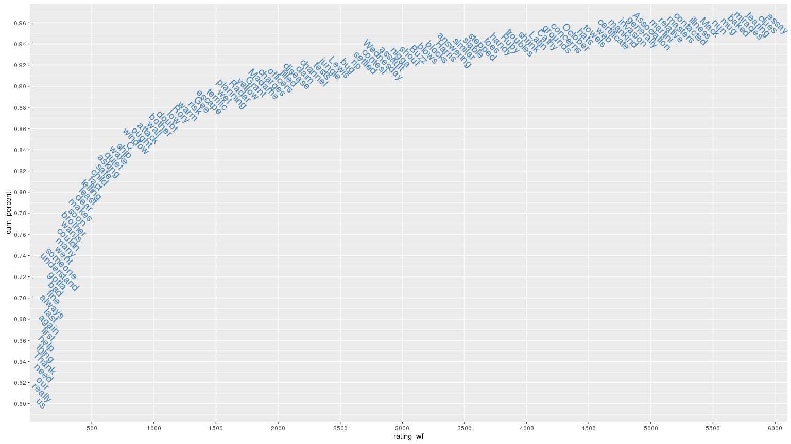
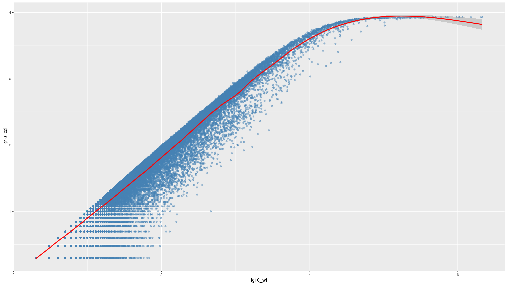
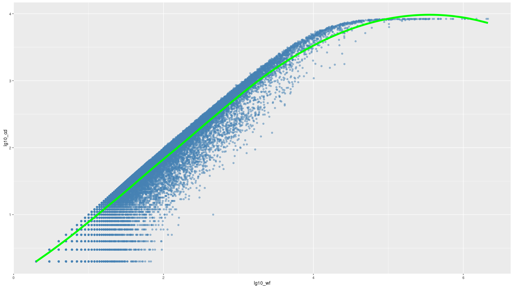
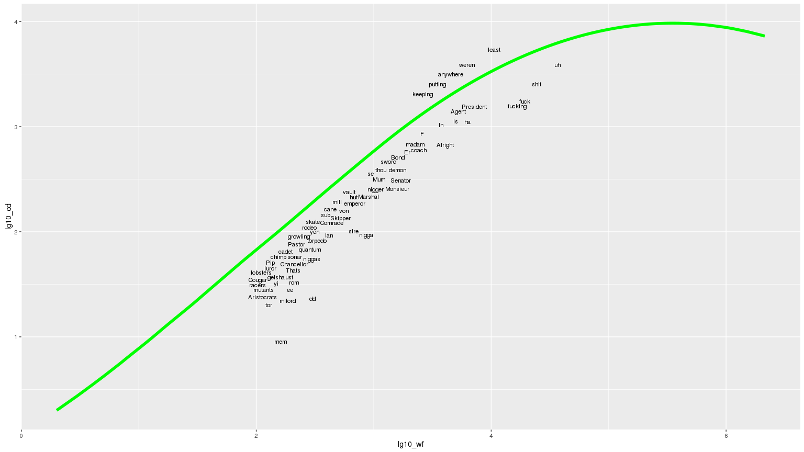

# English words frequency
NighTurs  
December 20, 2015  


Read and clean data.

```r
wf <- fread("data/SUBTLEXus74286wordstextversion.txt", header = T, sep = "\t")
wf <- rename(wf, word = Word, freq_count = FREQcount, cd_count = CDcount,
             freq_low = FREQlow, cd_low = Cdlow, subtl_wf = SUBTLWF, 
             lg10_wf = Lg10WF, subtl_cd = SUBTLCD, lg10_cd = Lg10CD)
wf <- wf[rev(order(freq_count)), rating_wf := .I]
setkey(wf, 'word')
str(wf)
```

```
## Classes 'data.table' and 'data.frame':	74286 obs. of  10 variables:
##  $ word      : chr  "Aa" "Aaa" "Aah" "Aargh" ...
##  $ freq_count: int  87 25 2688 33 747 1 1 75 4 1 ...
##  $ cd_count  : int  70 23 634 26 162 1 1 51 4 1 ...
##  $ freq_low  : int  6 5 52 2 0 0 0 17 1 0 ...
##  $ cd_low    : int  5 3 37 1 0 0 0 15 1 0 ...
##  $ subtl_wf  : num  1.71 0.49 52.71 0.65 14.65 ...
##  $ lg10_wf   : num  1.94 1.42 3.43 1.53 2.87 ...
##  $ subtl_cd  : num  0.83 0.27 7.56 0.31 1.93 0.01 0.01 0.61 0.05 0.01 ...
##  $ lg10_cd   : num  1.85 1.38 2.8 1.43 2.21 ...
##  $ rating_wf : int  12969 24881 1261 21703 3326 74284 74283 14127 48960 74282 ...
##  - attr(*, ".internal.selfref")=<externalptr> 
##  - attr(*, "sorted")= chr "word"
```

If we will consider top N words by frequency, what percentage of text they will cover?

```r
word_sum <- sum(wf$freq_count)
rank <- wf %>% mutate(freq_word = freq_count / word_sum) %>% 
    arrange(rating_wf) %>%
    mutate(cum_percent = cumsum(freq_word))

set.seed(12)
ggplot(rank[cum_percent > 0.6 & cum_percent < 0.96], 
       aes(rating_wf, cum_percent, label = word)) + 
    geom_text(check_overlap = T, size = 5, angle = -45, color = "steelblue") +
    scale_x_discrete(breaks = seq(0, 10000, 500)) +
    scale_y_continuous(breaks = seq(0, 1, 0.02))
```

 

How does overall frequency of word correlate it's film frequency?

```r
ggplot(wf, aes(lg10_wf, lg10_cd)) + 
    geom_point(alpha = 0.5, color = "steelblue") + 
    geom_smooth(color = "red")
```

 

Lets train model similar to one on previous plot (loess).

```r
set.seed(12)
fit <- loess(lg10_cd ~ lg10_wf, wf, span = 0.2, 
           control = loess.control(trace.hat = "approximate"))
```

```
## Warning in simpleLoess(y, x, w, span, degree, parametric, drop.square,
## normalize, : pseudoinverse used at 0.27086
```

```
## Warning in simpleLoess(y, x, w, span, degree, parametric, drop.square,
## normalize, : neighborhood radius 0.20624
```

```
## Warning in simpleLoess(y, x, w, span, degree, parametric, drop.square,
## normalize, : reciprocal condition number 2.4091e-26
```

```
## Warning in simpleLoess(y, x, w, span, degree, parametric, drop.square,
## normalize, : There are other near singularities as well. 0.031011
```

```r
pred <- predict(fit, wf)
```

Compute the root mean squared error (RMSE).

```r
rmse(wf$lg10_cd, pred)
```

```
## [1] 0.1425655
```

Plotting predictions line.

```r
ggplot(wf, aes(lg10_wf, lg10_cd)) + 
    geom_point(alpha = 0.5, color = "steelblue") + 
    geom_line(data = data.table(lg10_wf = wf$lg10_wf, 
                                  lg10_cd = pred), 
                aes(lg10_wf, lg10_cd), color = "green", size = 2)
```

 

Seems like there are a lot of cases where word count it movies is less than expected (outliers under curve). Assuming that those cases will have higher prediction errors we can check what they are. Only interested in high frequency words, so will cap them by log10 of overall frequency > 2.

```r
wf <- mutate(wf, fit_error = abs(wf$lg10_cd - pred))
high_errors <- wf[rev(order(fit_error))][lg10_wf > 2]
print(head(high_errors[,.(word, freq_count, cd_count, fit_error)], 30))
```

```
##           word freq_count cd_count fit_error
##  1:       Bret        459        9 1.4527400
##  2:    Stifler        128        4 1.2308180
##  3: Macfarlane        114        4 1.1849568
##  4:        Toa        157        6 1.1665072
##  5:      Cleve        112        5 1.0987517
##  6:        mem        160        8 1.0650262
##  7:      Fayed        301       17 1.0237646
##  8:     Mulder       1671       93 0.9916354
##  9:   Baldrick        354       24 0.9482951
## 10:   Hercules       1285       82 0.9460630
## 11:      Pongo        130        9 0.9359776
## 12:   Felicity        857       58 0.9342067
## 13:       Rory       2809      166 0.9260242
## 14:         dd        300       22 0.9160244
## 15:      Cheng        217       16 0.9136335
## 16:     Fabian        147       11 0.9057954
## 17:        Tha        632       47 0.9011481
## 18:   Starling        104        8 0.8932058
## 19:      Paine        141       11 0.8890687
## 20:        Neo        110        9 0.8697506
## 21:  Bannister        219       18 0.8689460
## 22:       Weli       1993      146 0.8617935
## 23:         Hy        119       10 0.8595741
## 24:     Dickie        306       26 0.8544613
## 25:       Dory        185       16 0.8480670
## 26:        Fei        196       17 0.8468905
## 27:      Pacey        890       74 0.8451366
## 28:      Hanna        275       24 0.8437490
## 29:    Bateman        103        9 0.8435062
## 30:       Dowd        125       11 0.8412469
##           word freq_count cd_count fit_error
```

A lot of names here. In movies people tend to call each other by name less? As we know that names typically start with capital letter, we can make it more interesting by looking only for words often typed with small letters.

```r
high_errors_low <- wf[rev(order(fit_error))][lg10_wf > 2 & 
                                                 freq_low * 3 > freq_count]
print(head(high_errors_low[,.(word, freq_count, cd_count, fit_error)], 30))
```

```
##             word freq_count cd_count fit_error
##  1:          mem        160        8 1.0650262
##  2:           dd        300       22 0.9160244
##  3:        nigga        864       92 0.7398382
##  4:       milord        184       21 0.7338869
##  5:           ee        192       27 0.6465397
##  6:          tor        127       19 0.6256936
##  7:          rom        208       32 0.6080248
##  8:         sire        671      100 0.6023066
##  9:           Ai        194       32 0.5794170
## 10:     Monsieur       1585      254 0.5385849
## 11:       niggas        297       54 0.5331123
## 12:   slipstream        144       27 0.5295120
## 13:          ust        189       36 0.5190867
## 14:  Aristocrats        112       23 0.4967517
## 15:   Archbishop        188       38 0.4940049
## 16:        Thats        204       42 0.4851314
## 17:      Senator       1691      305 0.4834729
## 18:           yi        147       31 0.4798954
## 19:         bale        104       23 0.4672058
## 20:         Boon        108       24 0.4645426
## 21: snowboarding        107       24 0.4608361
## 22:         moor        101       23 0.4555162
## 23:       Squire        157       35 0.4553072
## 24:      fucking      16603     1556 0.4519673
## 25:          lan        417       91 0.4498318
## 26:         dont        265       59 0.4481576
## 27:   Chancellor        210       48 0.4403202
## 28:      Alright       4044      671 0.4399891
## 29:         fuck      19307     1734 0.4372471
## 30:      mutants        114       27 0.4367568
##             word freq_count cd_count fit_error
```

Let's plot some of them

```r
ggplot(wf, aes(lg10_wf, lg10_cd)) + 
    geom_line(data = data.table(lg10_wf = wf$lg10_wf, 
                                  lg10_cd = pred), 
                aes(lg10_wf, lg10_cd), color = "green", size = 2) +
    geom_text(data = head(high_errors_low, 300), 
              aes(lg10_wf, lg10_cd, label = word), 
              size = 3,
              check_overlap = T)
```

 


